## investigating the bitcoin elliptic curve

output from `./btc-inquisitor/ec_poly.py -m`

the equation of the bitcoin elliptic curve is as follows:

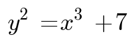

this equation is called `secp256k1` and looks like this:

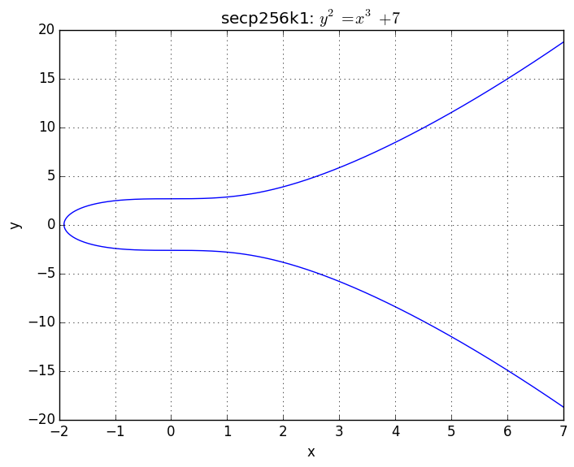

### lets have a look at how elliptic curve point addition works...

to add two points on the elliptic curve, just draw a line through them and find the third intersection with the curve, then mirror this third point about the `x`-axis. for example, adding point `p` to point `q`:

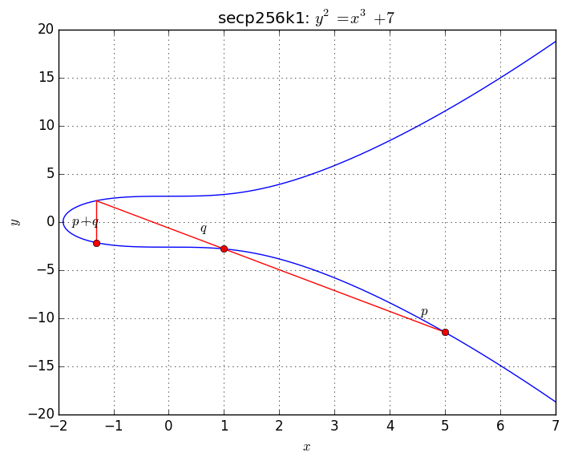

note that the third intersection with the curve can also lie between the points being added:

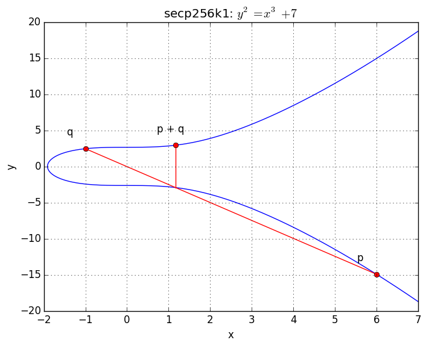

try moving point `q` towards point `p` along the curve:

clearly as `q` approaches `p`, the line between `q` and `p` approaches the tangent at `p`. and at `q = p` this line *is* the tangent. so a point can be added to itself (`p + p`, ie `2p`) by finding the tangent to the curve at that point and the third intersection with the curve:

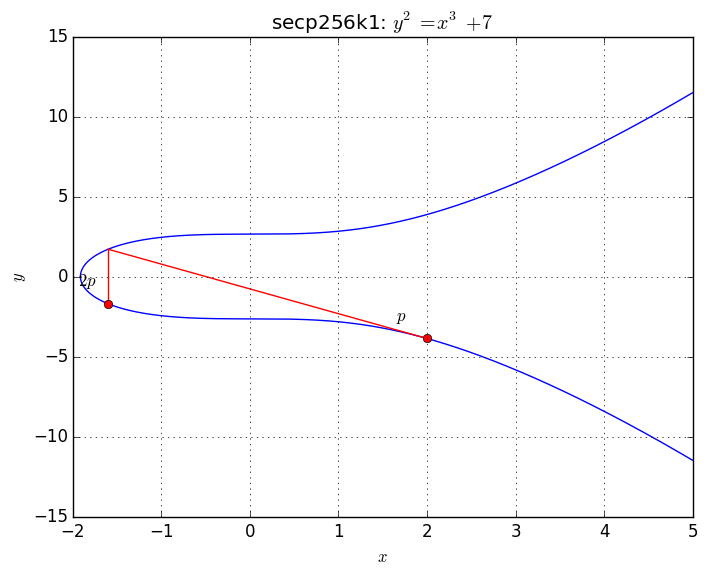

ok, but so what? when you say 'add points on the curve' is this just fancy mathematical lingo, or does this form of addition work like regular addition? for example does `p + p + p + p = 2p + 2p` on the curve?

to answer that, lets check with `p` at `x = 10` in the top half of the curve:

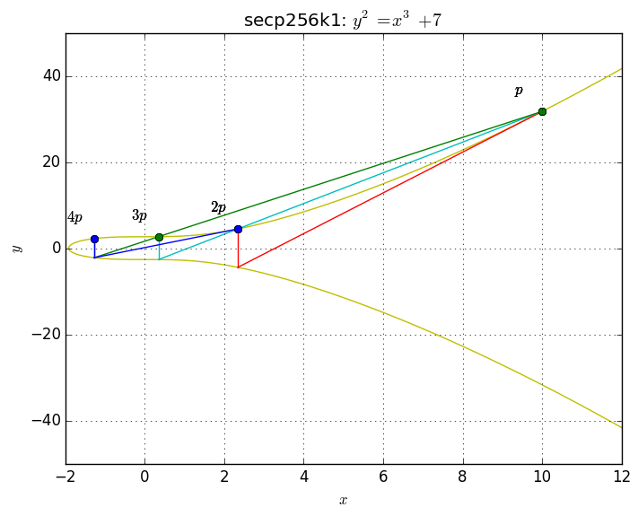

notice how the tangent to `2p` and the line through `p` and `3p` both result in the same intersection with the curve. lets zoom in to check:

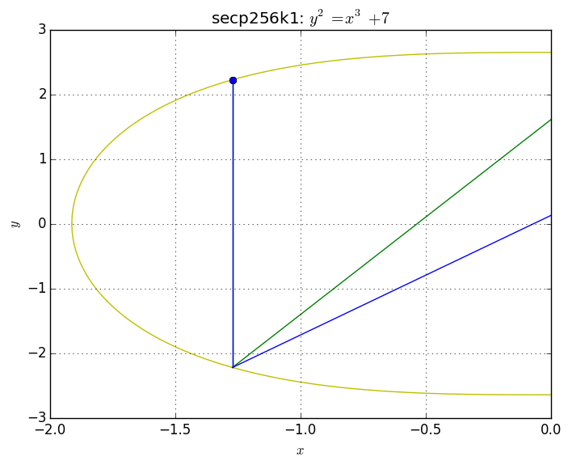

ok they sure seem to converge on the same point, but maybe `x = 10` is just a special case? does point addition work for other values of `x`?

lets try `x = 4` in the bottom half of the curve:

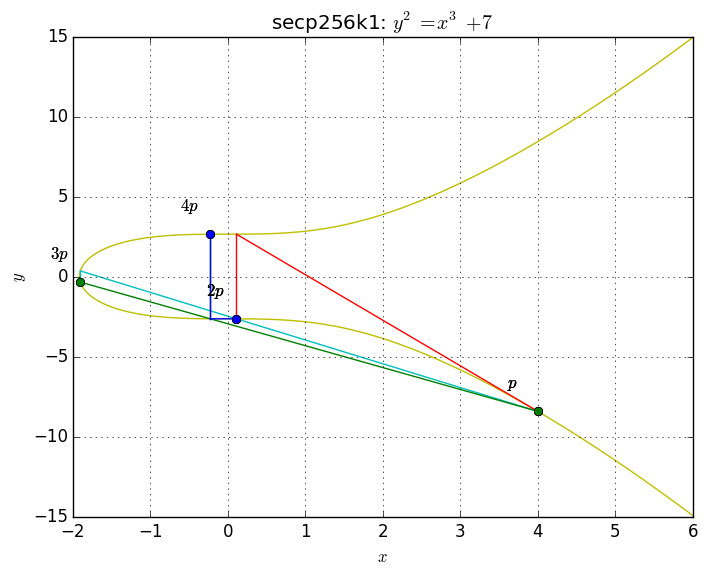

so far so good. zooming in:

cool. lets do one last check using point `x = 3` in the top half of the curve:

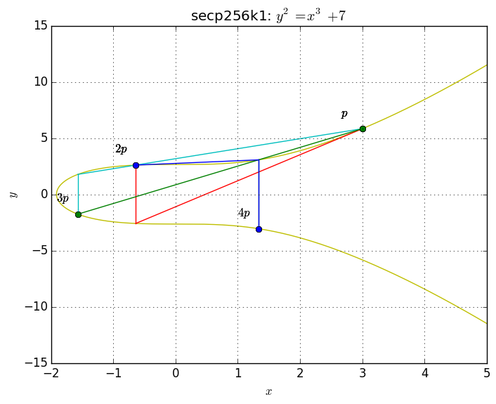

well, this point addition on the bitcoin elliptic curve certainly works in the graphs. but what if the graphs are innaccurate? maybe the point addition is only approximate and the graphs do not display the inaccuracy...

a more accurate way of testing whether point addition really does work would be to compute the `x` and `y` coordinates at point `p + p + p + p` and also compute the `x` and `y` coordinates at point `2p + 2p` and see if they are identical. lets check for `x = 10` and y in the top half of the curve:

`p + p + p + p = (-25983597172720/20434333412807, 205390966891466617199*sqrt(1007)/2931267467590684346699)`

`2p + 2p = (-25983597172720/20434333412807, 205390966891466617199*sqrt(1007)/2931267467590684346699)`

cool! clearly they are identical :) however lets check the more general case where `x` at point `p` is a variable in the bottom half of the curve:

at `p + p + p + p`, `x` is computed as:

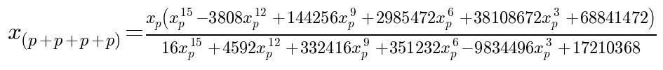

and `y` is computed as:

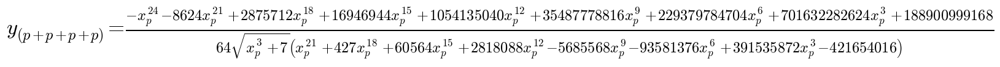

at `2p + 2p`, `x` is computed as:

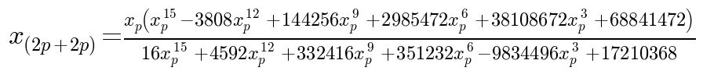

and `y` is computed as:

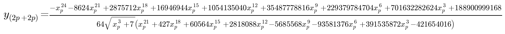

compare these results and you will see that that they are identical.this means that multiplication of points on the bitcoin elliptic curve really does work the same way as regular multiplication!

--------------------------------------------------------------------------------

TODO - subtraction, division, master public key, signatures

