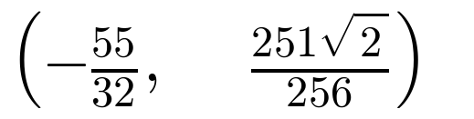
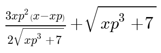
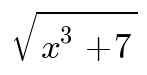
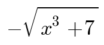
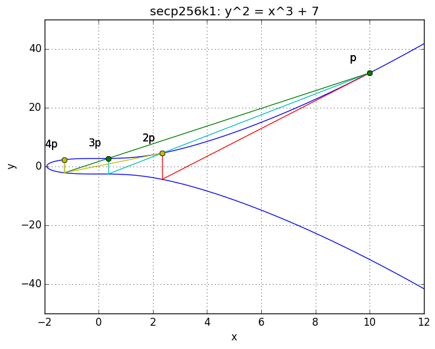

# output from `./ec_poly.py -m`

the intersection of the tangent line at x = 1 (positive y) with the curve in
non-reduced form:

-------------

the intersection of the tangent line at x = 1 (positive y) with the curve in reduced
form:

`(-1.71875000000000000000000000000, 1.38659220373299553612978074131)`

-------------

the equation of the tangent line which passes through x = xp (positive y) on the
curve:

`y = `

-------------

the equation of the bitcoin elliptic curve:

`y = `

and `y = `

-------------

plot the bitcoin elliptic curve and visually check that p + p + p + p = 2p + 2p
using xp = 10 (positive y):

-------------
