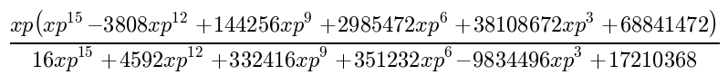
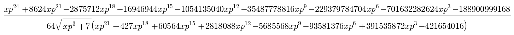
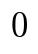
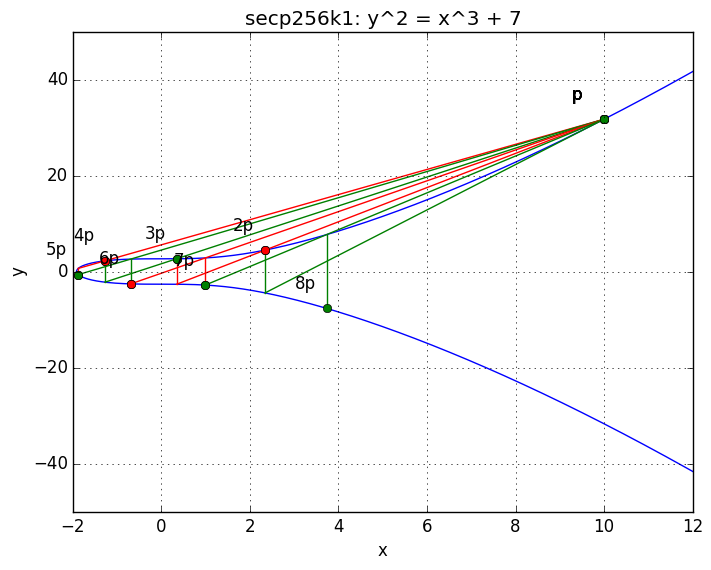

# output from `./ec_poly.py -m`

the intersection of the tangent line at x = 1 (positive y) with the curve in
non-reduced form:

-------------

the intersection of the tangent line at x = 1 (positive y) with the curve in reduced
form:

`(-1.71875000000000000000000000000, 1.38659220373299553612978074131)`

-------------

the equation of the tangent line which passes through x = xp (positive y) on the
curve:

`y = `

-------------

the equation of the bitcoin elliptic curve:

`y = `

and `y = `

-------------

plot the bitcoin elliptic curve and visually check that p + p + p + p = 2p + 2p
using xp = 10 (positive y):

-------------

calculate the intersection of the curve with p + p + p + p and check that it is
equal to the intersection of the curve with 2p + 2p:

p + p + p + p = `(-25983597172720/20434333412807, 205390966891466617199*sqrt(1007)/2931267467590684346699)`

2p + 2p = `(-25983597172720/20434333412807, 205390966891466617199*sqrt(1007)/2931267467590684346699)`

-------------

calculate the intersection of the curve with p + p + p + p for an arbitrary p of
`(xp, yp)` and check that it is equal to the intersection of the curve with
2p + 2p

x @ p + p + p + p:

y @ p + p + p + p:

x @ 2p + 2p:

y @ 2p + 2p:

should be 0 if x @ p + p + p + p = x @ 2p + 2p:

should be 0 if y @ p + p + p + p = y @ 2p + 2p:

-------------

plot the bitcoin elliptic curve and add point xp = 10 (positive y) to itself 7 times:

-------------

visually demonstrate the functionality of a master public/private key:

TODO

-------------
